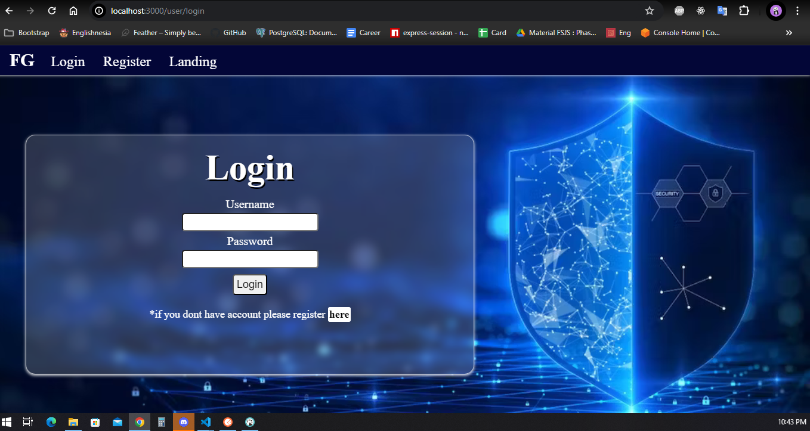
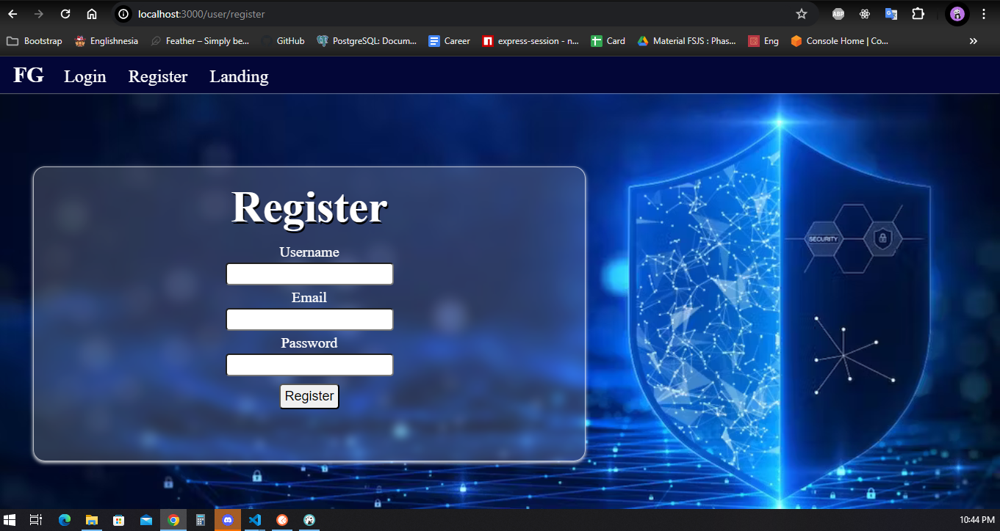
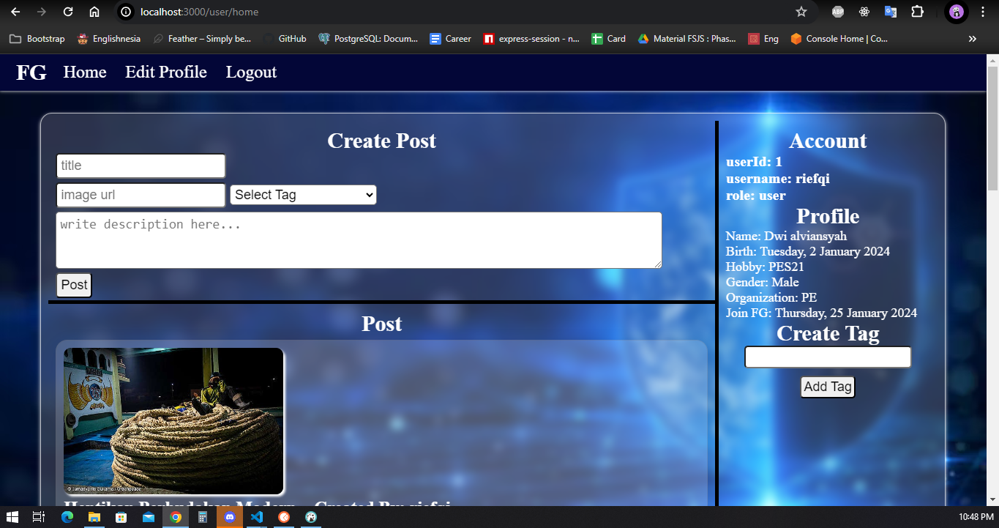
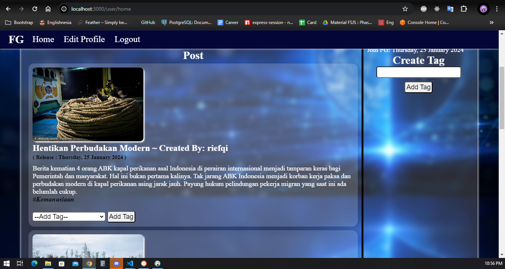

# Fact Guard

## deskripsi

- Merupakan aplikasi sosial media sederhana atas tugas pair project Hacktiv8 phase1
- Aplikasi dibuat dengan menggunakan
  - Express
  - Postgres
  - Sequelize
  - Bycryptjs
  - Express-session
  - EJS (Embedded JavaScript templating)

## rencana pengembangan

- implementasi error handler yang baik agar semua error terdaftar dan tidak membuat crash aplikasi
- tampilan masih perlu di perbaiki agar lebih simple dan user friendly
- perlu penerapan responsive design
- perlu modularisasi code dan penerapan DRY (Don't Repeat Yourself) khususnya pada komponen-komponen

## setup

- clone repo
  `git clone https://github.com/riefqialviansyah/fact-guard.git`
- enter folder repo
  `cd fact-guard`
- create database
  `npx sequelize db:create`
- migrate table
  `npx sequelize db:migrate`
- seeding user
  `npx sequelize db:seed:all`
- run app
  `npx nodemon app.js`

## display aplikasi

- Landing Page

  

- Login Page

  

- Register Page

  

- Home Page

  

- Post Page

  
